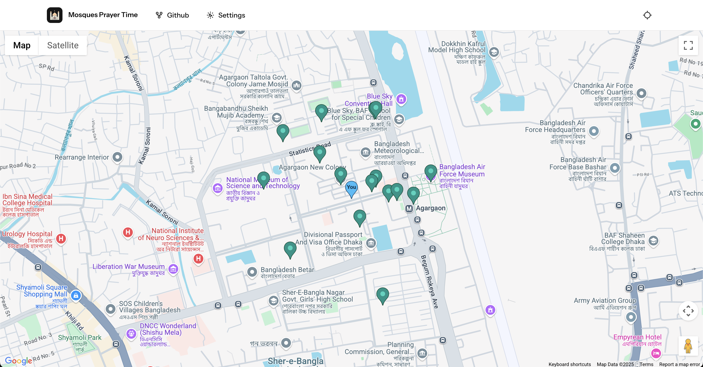
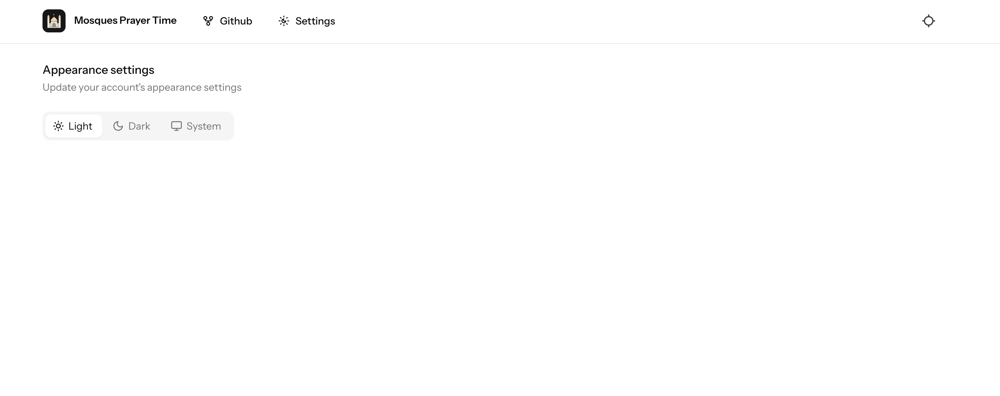
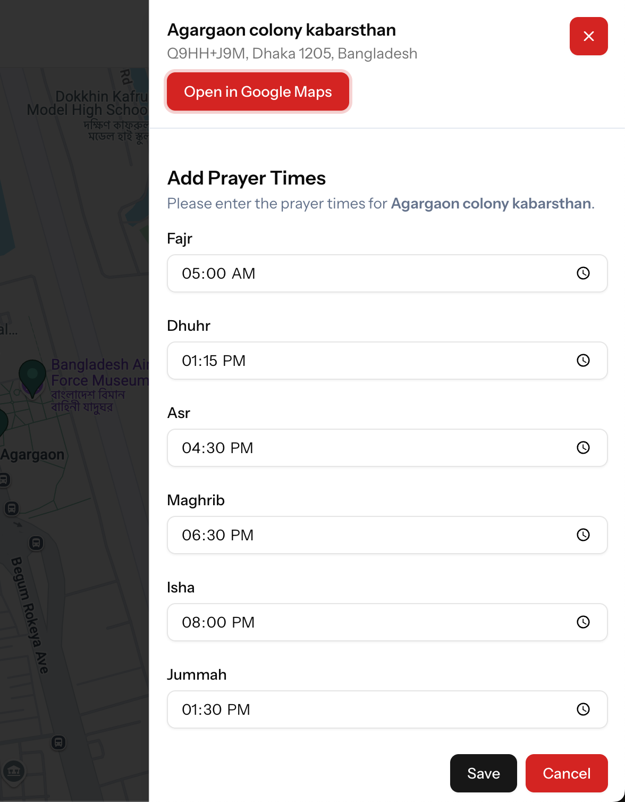
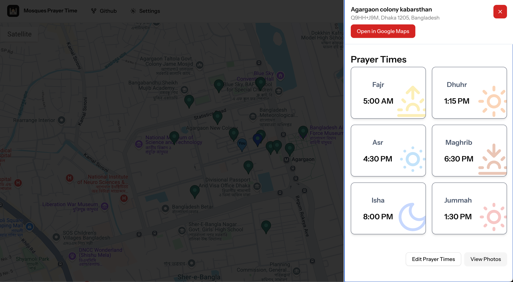

# Nearby Mosque Prayer Time finder

This apps is allow a user to find nearby mosque from a location and show the prayer times in the mosque, also allow the user to modify the mosque time.

## Installation

At first, clone the repository to your local machine using the following command:

```bash
git clone https://github.com/4msar/mosque-prayer-times.git nearby-mosque-prayer-time
```

Then, navigate to the project directory:

```bash
cd nearby-mosque-prayer-time
```

Next, install the required dependencies using composer:

```bash
composer install
```

## Configuration

Copy the `.env.example` file to `.env` and update the database connection settings in the `.env` file:

```bash
cp .env.example .env
```

Open the `.env` file in a text editor and update the following lines with your database credentials:

```env
DB_CONNECTION=mysql or sqlite

VITE_GOOGLE_MAP_API_KEY="your-google-map-api-key"
```

Must have a google map api key to use the map feature. You can get the key from [Google Cloud Console](https://console.cloud.google.com/).
You can use SQLite for development. To do this, set the `DB_CONNECTION` to `sqlite` and create a new SQLite database file:

```bash
touch database/database.sqlite
```

Then, generate the application key:

```bash
php artisan key:generate
```

## Database Migration

Run the following command to create the necessary database tables:

```bash
php artisan migrate
```

## Running the Application

To run the application, use the following command:

```bash
php artisan serve
```

This will start the application on `http://localhost:8000`. You can access it in your web browser.

## Usage

1. Open the application in your web browser.
2. Allow the application to access your location.
3. The application will display a map with nearby mosques and their prayer times.
4. Click on a mosque marker to view its details and prayer times.
5. You can modify the prayer times for a mosque by clicking on the "Edit" button.
6. After modifying the prayer times, click on the "Save" button to save the changes.
7. You can also click the top left location button to get your current location.
8. You can also change the theme of the application by clicking on the Settings page.

## Screenshots







